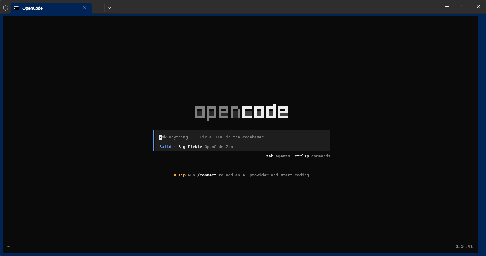

# OpenCode_Prj

* YOUTUBE :
    * https://youtu.be/cdJJ578gP6k

* Links
    * https://github.com/code-yeongyu/oh-my-openagent
    * https://github.com/code-yeongyu/oh-my-codex

## 1. Install

   * https://opencode.ai/

```
npm i -g opencode-ai
```

```
(base) C:\Users\Administrator>npm i -g opencode-ai

added 3 packages in 5s
npm notice
npm notice New minor version of npm available! 11.6.2 -> 11.14.1
npm notice Changelog: https://github.com/npm/cli/releases/tag/v11.14.1
npm notice To update run: npm install -g npm@11.14.1
npm notice
```

## 2. Opencode 실행

```
opencode
```



## 3. Mode : Tab 버튼 : Plan <-> Build


