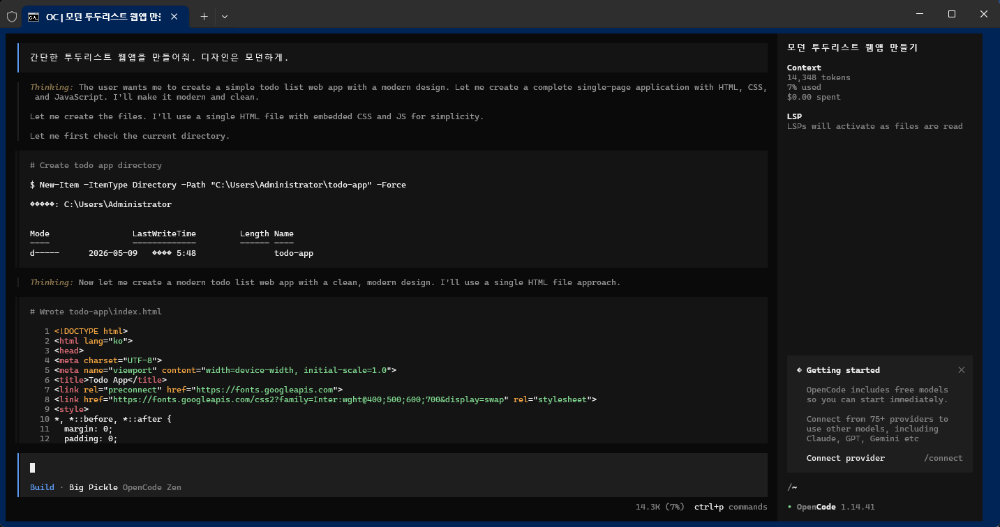
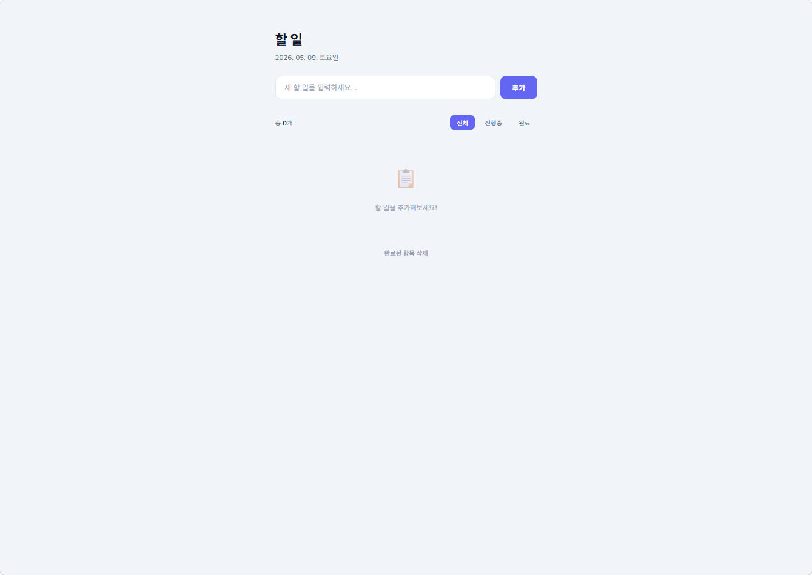
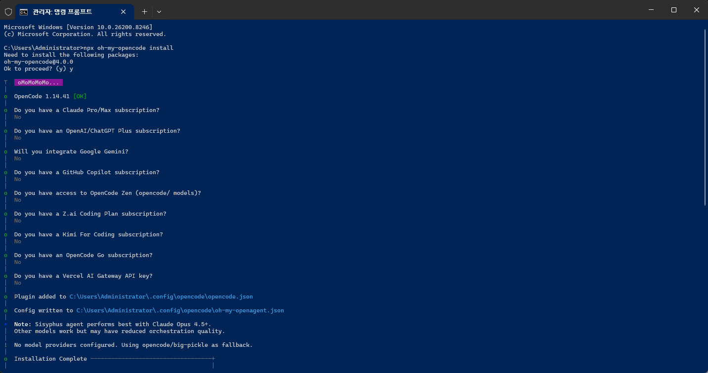
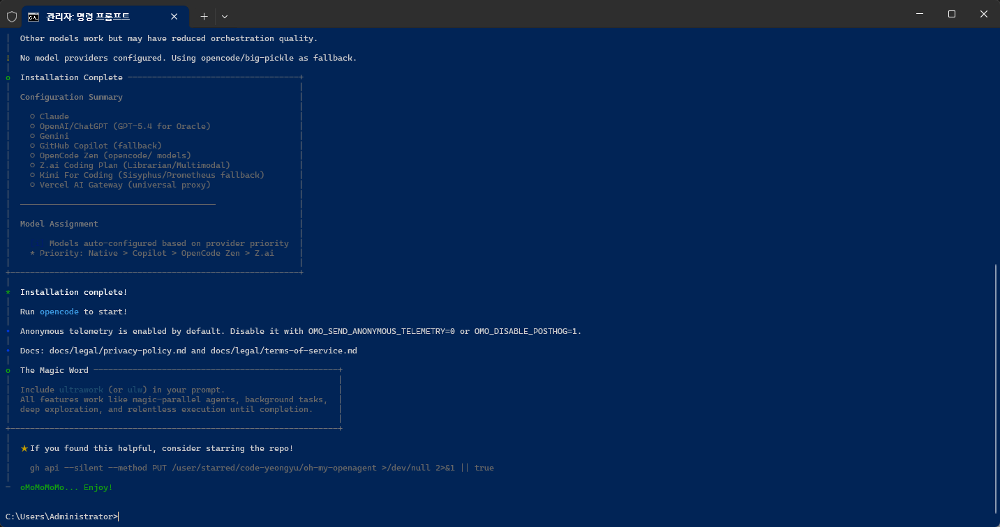

# OpenCode_Prj

* YOUTUBE :
    * https://youtu.be/cdJJ578gP6k

* Links
    * https://github.com/code-yeongyu/oh-my-openagent
    * https://github.com/code-yeongyu/oh-my-codex

## 1. Install

   * https://opencode.ai/

```
npm i -g opencode-ai
```

```
(base) C:\Users\Administrator>npm i -g opencode-ai

added 3 packages in 5s
npm notice
npm notice New minor version of npm available! 11.6.2 -> 11.14.1
npm notice Changelog: https://github.com/npm/cli/releases/tag/v11.14.1
npm notice To update run: npm install -g npm@11.14.1
npm notice
```

## 2. Opencode 실행

```
opencode
```


## 3. Mode : Tab 버튼 : Plan <-> Build

<br>


## 4. 다른모델 선택
   * "/"
   * /connect 에서 모델을 선택하면 됨.

<details>
<summary>접기/펼치기</summary>
<br>
<br>
<br>
<br>
<br>
<br>
<br>
<br>
<br>
</details>

* Popular (인기 항목)
   * OpenCode Zen (Recommended)
   * OpenCode Go
   * OpenAI (ChatGPT Plus/Pro or API key)
   * GitHub Copilot
   * Anthropic (API key)
   * Google
* Providers (제공자 목록)
   * 302.AI
   * Alibaba / Alibaba (China) / Alibaba Coding Plan (China)
   * Scaleway
   * NanoGPT
   * Abacus
   * Perplexity / Perplexity Agent
   * SiliconFlow / SiliconFlow (China)
   * submodel
   * MiniMax (minimaxi.com) / MiniMax Coding Plan (minimax.io / minimaxi.com)
   * DeepSeek
   * Llama
   * OpenRouter
   * Fireworks AI
   * Kimi For Coding
   * Moark
   * IO.NET
   * Jiekou.AI
   * Bailing
   * iFlow
   * v0
   * Hugging Face
   * ZenMux
   * Upstage
   * NovitaAI
   * Xiaomi Token Plan (China / Europe / Singapore)
   * Weights & Biases
   * Chutes
   * DInference
   * Vivgrid
   * Deep Infra
   * Qiniu
   * Kilo Gateway
   * SAP AI Core
   * Morph
   * Cloudflare AI Gateway / Cloudflare Workers AI
   * Mixlayer
   * Z.AI / Z.AI Coding Plan
   * StepFun
   * Nebius Token Factory
   * Poe
   * Helicone
   * Ollama Cloud
   * Amazon Bedrock
   * The Grid AI
   * Baseten
   * FrogBot
   * Zhipu AI / Zhipu AI Coding Plan
   * Venice AI
   * AIHubMix
   * Cerebras
   * LMStudio
   * LucidQuery AI
   * Moonshot AI / Moonshot AI (China)
   * Azure Cognitive Services / Azure
   * abliteration.ai
   * Wafer
   * Cohere
   * CloudFerro Sherlock
   * KUAE Cloud Coding Plan
   * xAI
   * Meganova
   * Vertex (Anthropic) / Vertex
   * evroc
   * Synthetic
   * Nvidia
   * Inference
   * Inception
   * Kiro
   * Requesty
   * DigitalOcean
   * Vultr
   * Mistral
   * OVHcloud AI Endpoints
   * Friendli
   * Cortecs
   * Vercel AI Gateway
   * LLM Gateway
   * Groq
   * FastRouter
   * STACKIT
   * Tencent TokenHub / Tencent Coding Plan (China)
   * Privatemode AI
   * D.Run (China)
   * Berget.AI
   * GitHub Models
   * Neuralwatt
   * Together AI
   * QiHang
   * HPC-AI
   * GitLab Duo
   * Clarifai
   * Regolo AI
   * Nova
   * Other Custom provider


## OpenCode AI Model Providers Overview (2026 Edition)

이 문서는 OpenCode 플랫폼에서 연결 가능한 주요 모델 제공자들의 기술적 특징, 비용 구조 및 오케스트레이션 적합성을 정리한 가이드입니다.

### 🚀 모델 제공자 비교 테이블

| 제공자 (Provider) | 유료/무료 여부 | 성능 (SWE-bench) | 사용자 규모 | Orchestration/Harness | 주요 파라미터 및 특징 |
| :--- | :--- | :--- | :--- | :--- | :--- |
| **OpenCode Zen** | Pay-as-you-go | **최상** (80.6%+) | 수백만 명 (SOTA 타겟) | **매우 유리** (전용 API) | 프리미엄 모델 전문, $20 충전 방식 |
| **OpenCode Go** | $10/월 구독 | 상 (70~80%급) | 중 (개인 개발자 위주) | **유리** (Fallback 지원) | 달러 기반 크레딧($60/월), MiniMax/Qwen 포함 |
| **OpenAI (Codex)** | $20~$200/월 | **최상** (80.0%+) | 전 세계 1위 | **최상** (Agent 전용) | GPT-5.4 기반, 5단계 추론 수준 설정 가능 |
| **Anthropic** | $20/월 (Pro) | **최상** (80.8%+) | 최상위권 | **강력** (Claude Code) | 1M Context Window, Opus 4.6 주력 |
| **DeepSeek (V4)** | 무료/저렴한 API | 상 (80.0% claimed) | 급성장 중 | 유리 (가성비 오케스트레이션) | $2-5/1M 토큰 (가장 경제적) |
| **GitHub Models** | 무료(제한적)/유료 | 중상 (다양한 모델) | 수천만 명 | 유리 (GitHub Ecosystem) | BYOK(Bring Your Own Key) 방식 지원 |
| **MiniMax** | $10/월 (Go 포함) | 상 (80.2%) | 중 (아시아권 강세) | 보통 (Routine tasks) | SWE-Bench 고득점, 루틴 코딩 최적화 |
| **Kimi (Moonshot)** | 유료/무료 | 상 (K2.6 기반) | 중 | **우수** (Agentic 성능) | 다단계 자율 추론(8시간 연속 작동 가능) |
| **Google (Gemini)** | 무료/유료($19+) | 중상 (70% 추정) | 최상위권 | 유리 (GCP 통합) | Gemini 3.1 Pro, 대규모 컨텍스트 처리 강점 |
| **Ollama (Local)** | **무료** (Self-host) | 하~상 (HW 사양 의존) | 오픈소스 커뮤니티 | **강력** (Privacy/Local) | 개인 정보 보호 최우선, 로컬 GPU 자원 사용 |

### 🛠 주요 선정 지표 가이드

1. **Performance (SWE-bench Verified):** 실제 소프트웨어 엔지니어링 문제를 해결하는 능력을 나타내는 지표입니다. 80% 이상은 업계 최상위(SOTA) 수준으로 평가됩니다.
2. **Orchestration/Harness:** 여러 모델을 연동하거나(Chain), 에이전트가 자율적으로 도구를 사용하는 환경에서의 안정성 및 API 지원 여부입니다.
3. **사용자 규모:** 커뮤니티 지원 및 검증된 케이스의 양을 의미하며, "최상"일수록 문제 해결이 용이합니다.
4. **특이사항:**
   * **OpenCode Zen**은 종량제(Pay-as-you-go)로 가장 강력한 모델을 필요할 때만 호출하기 좋습니다.
   * **OpenCode Go**는 월 $10로 MiniMax M2.7 등 우수한 오픈 소스 계열 모델을 무제한에 가깝게 사용할 수 있는 가성비 플랜입니다.

---

## OpenWebUI

* Ctrl + 'p' : 지금은 안보이네?



---

## 예제1 : 간단한 투두리스트 웹앱을 만들어줘. 디자인은 모던하게.




```
# Wrote todo-app\index.html
<!DOCTYPE html>
<html lang="ko">
<head>
<meta charset="UTF-8">
<meta name="viewport" content="width=device-width, initial-scale=1.0">
<title>Todo App</title>
<link rel="preconnect" href="https://fonts.googleapis.com">
<link href="https://fonts.googleapis.com/css2?family=Inter:wght@400;500;600;700&display=swap" rel="stylesheet">
<style>
*, *::before, *::after {
  margin: 0;
  padding: 0;
  box-sizing: border-box;
}
body {
  font-family: 'Inter', -apple-system, sans-serif;
  background: #f1f5f9;
  min-height: 100vh;
  display: flex;
  justify-content: center;
  padding: 60px 24px;
  color: #1e293b;
}
.container {
  width: 100%;
  max-width: 540px;
}
h1 {
  font-size: 28px;
  font-weight: 700;
  color: #0f172a;
  margin-bottom: 8px;
  letter-spacing: -0.5px;
}
.subtitle {
  color: #64748b;
  font-size: 14px;
  margin-bottom: 28px;
}
.input-row {
  display: flex;
  gap: 10px;
  margin-bottom: 32px;
}
.input-row input {
  flex: 1;
  padding: 14px 18px;
  border: 2px solid #e2e8f0;
  border-radius: 12px;
  font-size: 15px;
  font-family: inherit;
  background: #fff;
  transition: border-color 0.2s, box-shadow 0.2s;
  outline: none;
}
.input-row input:focus {
  border-color: #6366f1;
  box-shadow: 0 0 0 4px rgba(99,102,241,0.12);
}
.input-row input::placeholder {
  color: #94a3b8;
}
.btn {
  padding: 14px 24px;
  border: none;
  border-radius: 12px;
  font-size: 15px;
  font-weight: 600;
  font-family: inherit;
  cursor: pointer;
  transition: all 0.2s;
  white-space: nowrap;
}
.btn-primary {
  background: #6366f1;
  color: #fff;
}
.btn-primary:hover {
  background: #4f46e5;
  transform: translateY(-1px);
  box-shadow: 0 4px 12px rgba(99,102,241,0.35);
}
.btn-primary:active {
  transform: translateY(0);
}
.stats {
  display: flex;
  justify-content: space-between;
  align-items: center;
  margin-bottom: 16px;
  font-size: 13px;
  color: #64748b;
}
.stats .count {
  font-weight: 600;
  color: #1e293b;
}
.filters {
  display: flex;
  gap: 6px;
}
.filter-btn {
  padding: 6px 14px;
  border-radius: 8px;
  border: none;
  background: transparent;
  font-size: 13px;
  font-weight: 500;
  font-family: inherit;
  color: #64748b;
  cursor: pointer;
  transition: all 0.2s;
}
.filter-btn:hover {
  background: #e2e8f0;
  color: #1e293b;
}
.filter-btn.active {
  background: #6366f1;
  color: #fff;
}
.todo-list {
  list-style: none;
}
.todo-item {
  display: flex;
  align-items: center;
  gap: 14px;
  background: #fff;
  padding: 16px 18px;
  border-radius: 12px;
  margin-bottom: 8px;
  box-shadow: 0 1px 3px rgba(0,0,0,0.04);
  transition: all 0.2s;
  animation: slideIn 0.25s ease;
}
.todo-item:hover {
  box-shadow: 0 4px 16px rgba(0,0,0,0.06);
  transform: translateY(-1px);
}
@keyframes slideIn {
  from { opacity: 0; transform: translateY(8px); }
  to { opacity: 1; transform: translateY(0); }
}
.todo-check {
  width: 22px;
  height: 22px;
  border-radius: 50%;
  border: 2px solid #cbd5e1;
  cursor: pointer;
  flex-shrink: 0;
  display: flex;
  align-items: center;
  justify-content: center;
  transition: all 0.25s;
  background: #fff;
}
.todo-check:hover {
  border-color: #6366f1;
}
.todo-check.checked {
  background: #6366f1;
  border-color: #6366f1;
}
.todo-check.checked::after {
  content: '';
  width: 8px;
  height: 4px;
  border-left: 2px solid #fff;
  border-bottom: 2px solid #fff;
  transform: rotate(-45deg) translateY(-1px);
  margin-top: -1px;
}
.todo-text {
  flex: 1;
  font-size: 15px;
  line-height: 1.4;
  word-break: break-word;
  cursor: pointer;
  padding: 2px 0;
}
.todo-text.done {
  text-decoration: line-through;
  color: #94a3b8;
}
.todo-delete {
  width: 32px;
  height: 32px;
  border: none;
  background: transparent;
  border-radius: 8px;
  cursor: pointer;
  font-size: 18px;
  color: #94a3b8;
  display: flex;
  align-items: center;
  justify-content: center;
  transition: all 0.2s;
  flex-shrink: 0;
}
.todo-delete:hover {
  background: #fef2f2;
  color: #ef4444;
}
.empty {
  text-align: center;
  padding: 48px 24px;
  color: #94a3b8;
  font-size: 14px;
  line-height: 1.8;
}
.empty-icon {
  font-size: 40px;
  margin-bottom: 12px;
  opacity: 0.5;
}
.clear-all {
  margin-top: 16px;
  text-align: center;
}
.btn-ghost {
  background: transparent;
  color: #94a3b8;
  font-size: 13px;
  padding: 8px 16px;
}
.btn-ghost:hover {
  color: #ef4444;
  background: #fef2f2;
}
</style>
</head>
<body>
<div class="container">
  <h1>할 일</h1>
  <p class="subtitle"><span id="dateDisplay"></span></p>
  <div class="input-row">
    <input type="text" id="todoInput" placeholder="새 할 일을 입력하세요..." autofocus>
    <button class="btn btn-primary" id="addBtn">추가</button>
  </div>
  <div class="stats">
    <span>총 <span class="count" id="totalCount">0</span>개</span>
    <div class="filters">
      <button class="filter-btn active" data-filter="all">전체</button>
      <button class="filter-btn" data-filter="active">진행중</button>
      <button class="filter-btn" data-filter="done">완료</button>
    </div>
  </div>
  <ul class="todo-list" id="todoList"></ul>
  <div class="clear-all">
    <button class="btn btn-ghost" id="clearDoneBtn">완료된 항목 삭제</button>
  </div>
</div>
<script>
const STORAGE_KEY = 'todos';
let todos = JSON.parse(localStorage.getItem(STORAGE_KEY)) || [];
let filter = 'all';
const todoInput = document.getElementById('todoInput');
const addBtn = document.getElementById('addBtn');
const todoList = document.getElementById('todoList');
const totalCount = document.getElementById('totalCount');
const dateDisplay = document.getElementById('dateDisplay');
function updateDate() {
  const now = new Date();
  const y = now.getFullYear();
  const m = String(now.getMonth() + 1).padStart(2, '0');
  const d = String(now.getDate()).padStart(2, '0');
  const days = ['일요일', '월요일', '화요일', '수요일', '목요일', '금요일', '토요일'];
  const day = days[now.getDay()];
  dateDisplay.textContent = `${y}. ${m}. ${d}. ${day}`;
}
updateDate();
function save() {
  localStorage.setItem(STORAGE_KEY, JSON.stringify(todos));
}
function render() {
  const filtered = todos.filter(t => {
    if (filter === 'active') return !t.done;
    if (filter === 'done') return t.done;
    return true;
  });
  totalCount.textContent = todos.length;
  if (filtered.length === 0) {
    const msg = filter === 'all' ? '할 일을 추가해보세요!' : filter === 'active' ? '모든 할 일을 완료했습니다!' : '완료된 항목이 없습니다.';
    todoList.innerHTML = `<li class="empty"><div class="empty-icon">📋</div>${msg}</li>`;
    return;
  }
  todoList.innerHTML = filtered.map(t => `
    <li class="todo-item" data-id="${t.id}">
      <div class="todo-check ${t.done ? 'checked' : ''}" onclick="toggle(${t.id})"></div>
      <span class="todo-text ${t.done ? 'done' : ''}" onclick="toggle(${t.id})">${escapeHtml(t.text)}</span>
      <button class="todo-delete" onclick="remove(${t.id})">✕</button>
    </li>
  `).join('');
}
function escapeHtml(text) {
  const div = document.createElement('div');
  div.textContent = text;
  return div.innerHTML;
}
function addTodo() {
  const text = todoInput.value.trim();
  if (!text) return;
  todos.push({ id: Date.now(), text, done: false });
  todoInput.value = '';
  save();
  render();
  todoInput.focus();
}
function toggle(id) {
  const todo = todos.find(t => t.id === id);
  if (todo) {
    todo.done = !todo.done;
    save();
    render();
  }
}
function remove(id) {
  todos = todos.filter(t => t.id !== id);
  save();
  render();
  todoInput.focus();
}
addBtn.addEventListener('click', addTodo);
todoInput.addEventListener('keydown', e => { if (e.key === 'Enter') addTodo(); });
document.querySelectorAll('.filter-btn').forEach(btn => {
  btn.addEventListener('click', () => {
    document.querySelectorAll('.filter-btn').forEach(b => b.classList.remove('active'));
    btn.classList.add('active');
    filter = btn.dataset.filter;
    render();
  });
});
document.getElementById('clearDoneBtn').addEventListener('click', () => {
  todos = todos.filter(t => !t.done);
  save();
  render();
});
render();
</script>
</body>
</html>
```

## 예제2 : 에이전트 협업

   * oh-my-opencode
```
npx oh-my-opencode install
```

```
Microsoft Windows [Version 10.0.26200.8246]
(c) Microsoft Corporation. All rights reserved.

C:\Users\Administrator>npx oh-my-opencode install
Need to install the following packages:                                                                                                                                                                 oh-my-opencode@4.0.0
Ok to proceed? (y) y

T   oMoMoMoMo...
|
o  OpenCode 1.14.41 [OK]
|
o  Do you have a Claude Pro/Max subscription?
|  No
|
o  Do you have an OpenAI/ChatGPT Plus subscription?
|  No
|
o  Will you integrate Google Gemini?
|  No
|
o  Do you have a GitHub Copilot subscription?
|  No
|
o  Do you have access to OpenCode Zen (opencode/ models)?
|  No
|
o  Do you have a Z.ai Coding Plan subscription?
|  No
|
o  Do you have a Kimi For Coding subscription?
|  No
|
o  Do you have an OpenCode Go subscription?
|  No
|
o  Do you have a Vercel AI Gateway API key?
|  No
|
o  Plugin added to C:\Users\Administrator\.config\opencode\opencode.json
|
o  Config written to C:\Users\Administrator\.config\opencode\oh-my-openagent.json
|
•  Note: Sisyphus agent performs best with Claude Opus 4.5+.
|  Other models work but may have reduced orchestration quality.
|
!  No model providers configured. Using opencode/big-pickle as fallback.
|
o  Installation Complete -----------------------------------+
|                                                           |
|  Configuration Summary                                    |
|                                                           |
|    ○ Claude                                               |
|    ○ OpenAI/ChatGPT (GPT-5.4 for Oracle)                  |
|    ○ Gemini                                               |
|    ○ GitHub Copilot (fallback)                            |
|    ○ OpenCode Zen (opencode/ models)                      |
|    ○ Z.ai Coding Plan (Librarian/Multimodal)              |
|    ○ Kimi For Coding (Sisyphus/Prometheus fallback)       |
|    ○ Vercel AI Gateway (universal proxy)                  |
|                                                           |
|  ────────────────────────────────────────                 |
|                                                           |
|  Model Assignment                                         |
|                                                           |
|    [i] Models auto-configured based on provider priority  |
|    * Priority: Native > Copilot > OpenCode Zen > Z.ai     |
|                                                           |
+-----------------------------------------------------------+
|
*  Installation complete!
|
|  Run opencode to start!
|
•  Anonymous telemetry is enabled by default. Disable it with OMO_SEND_ANONYMOUS_TELEMETRY=0 or OMO_DISABLE_POSTHOG=1.
|
•  Docs: docs/legal/privacy-policy.md and docs/legal/terms-of-service.md
|
o  The Magic Word --------------------------------------------------+
|                                                                   |
|  Include ultrawork (or ulw) in your prompt.                       |
|  All features work like magic-parallel agents, background tasks,  |
|  deep exploration, and relentless execution until completion.     |
|                                                                   |
+-------------------------------------------------------------------+
|
|  ★ If you found this helpful, consider starring the repo!
|
|    gh api --silent --method PUT /user/starred/code-yeongyu/oh-my-openagent >/dev/null 2>&1 || true
|
—  oMoMoMoMo... Enjoy!
```

 <br>


* 설치 확인 후 opencode 실

```
opencode
```

* WebUI 사용

```
OpenCode는 터미널 기반의 AI 코딩 에이전트로, 자체적으로 웹 UI 기능을 내장하고 있거나 외부 Open WebUI와 연동하여 사용할 수 있습니다.  사용 목적에 따라 두 가지 방법 중 선택하여 설치 및 실행할 수 있습니다.1. OpenCode 내장 웹 UI 실행 방법OpenCode는 별도의 추가 설치 없이 명령어를 통해 즉시 웹 인터페이스를 띄울 수 있는 기능을 제공합니다.  실행 명령어: 터미널에서 다음 명령어를 입력합니다.Bashopencode web
특징: 이 명령어를 실행하면 로컬 호스트(보통 [http://127.0.0.1](http://127.0.0.1) 또는 설정된 포트)에서 작동하는 웹 UI가 브라우저에 자동으로 열립니다.단축키: OpenCode TUI(터미널 UI) 실행 중 Ctrl + P를 눌러 커맨드 팔레트를 연 뒤 webUI를 입력하여 실행할 수도 있습니다.  2. 외부 Open WebUI와 OpenCode 연동 방법Open WebUI(구 Ollama WebUI)를 별도로 설치하여 OpenCode의 모델들을 사용하고 싶다면, OpenCode를 서버 모드로 실행한 뒤 연동해야 합니다.  1단계: OpenCode 서버 실행Open WebUI가 OpenCode의 API를 호출할 수 있도록 헤드리스 서버 모드로 실행합니다.  Bashopencode serve
기본적으로 http://localhost:4096 등에서 API 서버가 가동됩니다.  2단계: Open WebUI 설치 (Docker 권장)Open WebUI 공식 설치 방식인 Docker를 사용하여 설치합니다.  Bashdocker run -d -p 3000:8080 -v open-webui:/app/backend/data --name open-webui ghcr.io/open-webui/open-webui:main
3단계: API 연결 설정브라우저에서 http://localhost:3000에 접속합니다.  Settings > Connections 메뉴로 이동합니다.  OpenAI API 연동 항목에 OpenCode 서버 주소를 입력합니다.  API URL: [https://opencode.ai/zen/v1/](https://opencode.ai/zen/v1/) (Zen API 사용 시) 또는 로컬 서버 주소API Key: OpenCode에서 발급받은 API 키를 입력합니다.참고: OpenCode 설치가 안 되어 있다면?  OpenCode 자체가 아직 설치되지 않았다면 아래 스크립트로 빠르게 설치할 수 있습니다.  macOS/Linux/WSL: curl -fsSL [https://opencode.ai/install](https://opencode.ai/install) | bashWindows (PowerShell): pnpm install -g opencode-ai 또는 scoop install opencode
```


