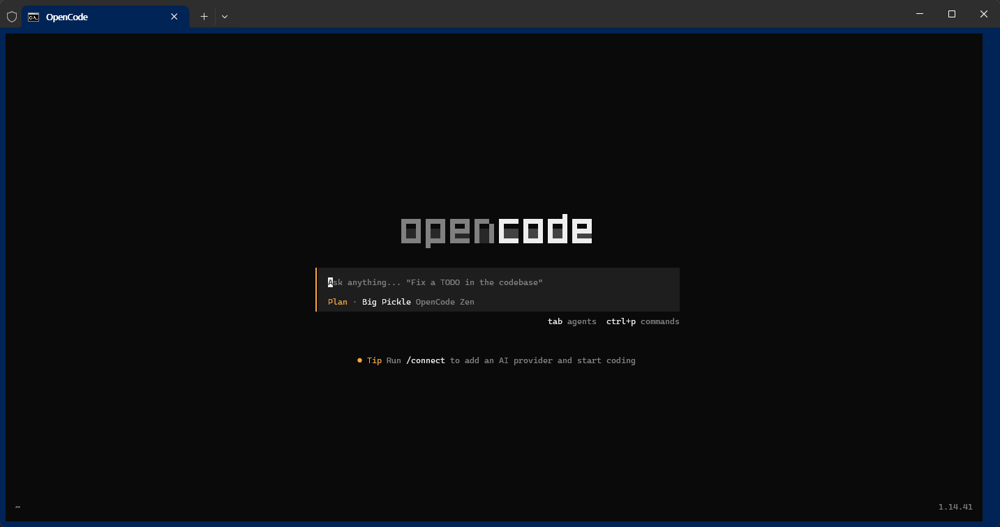
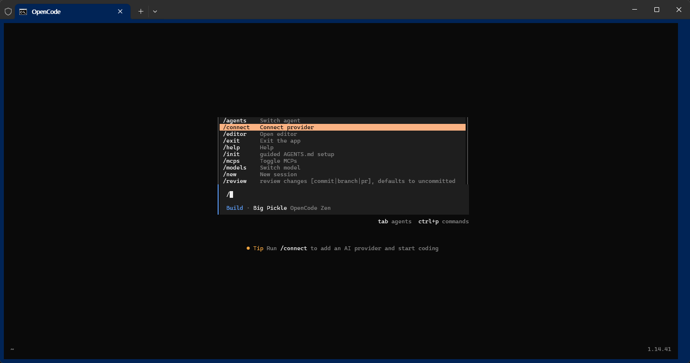
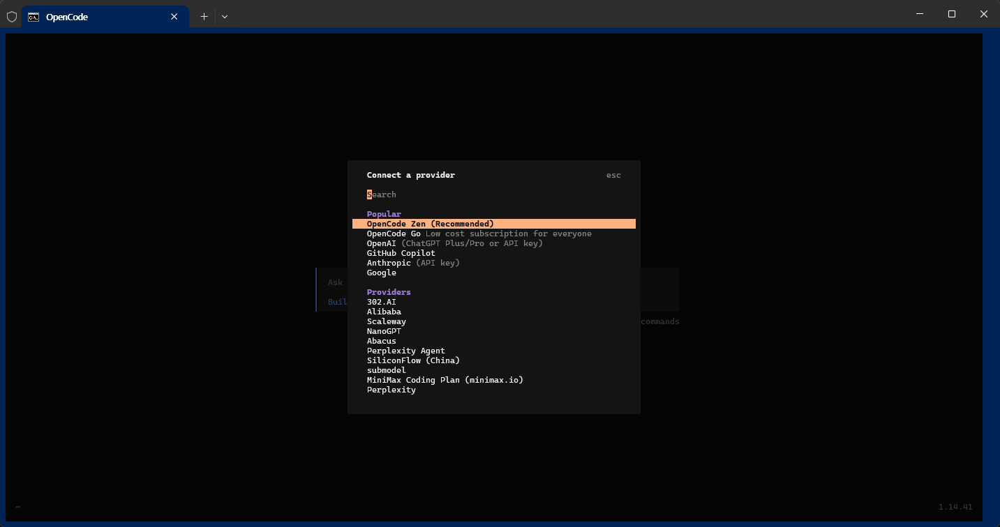
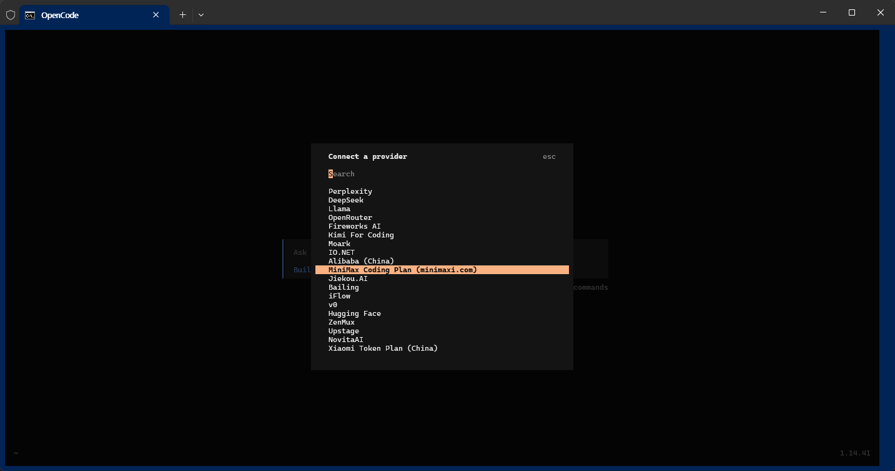
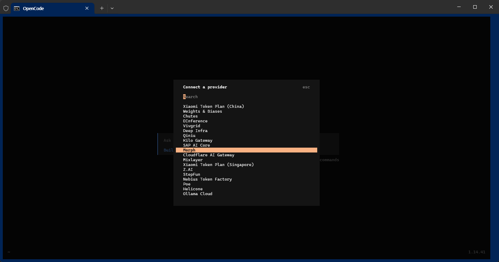
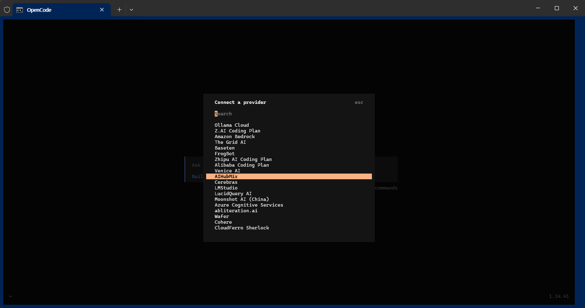
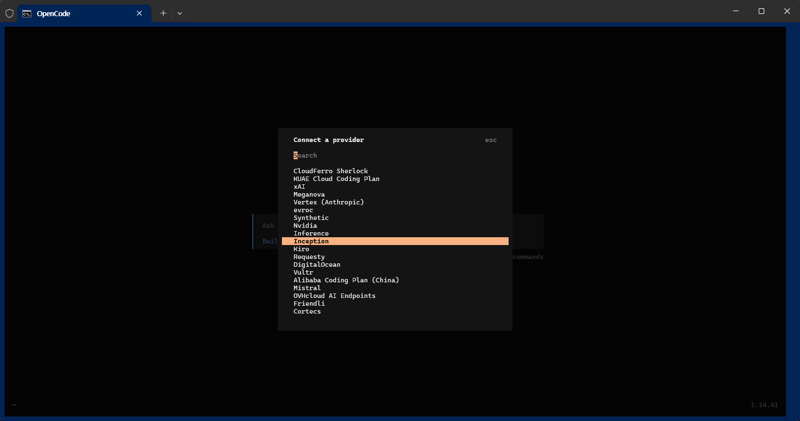
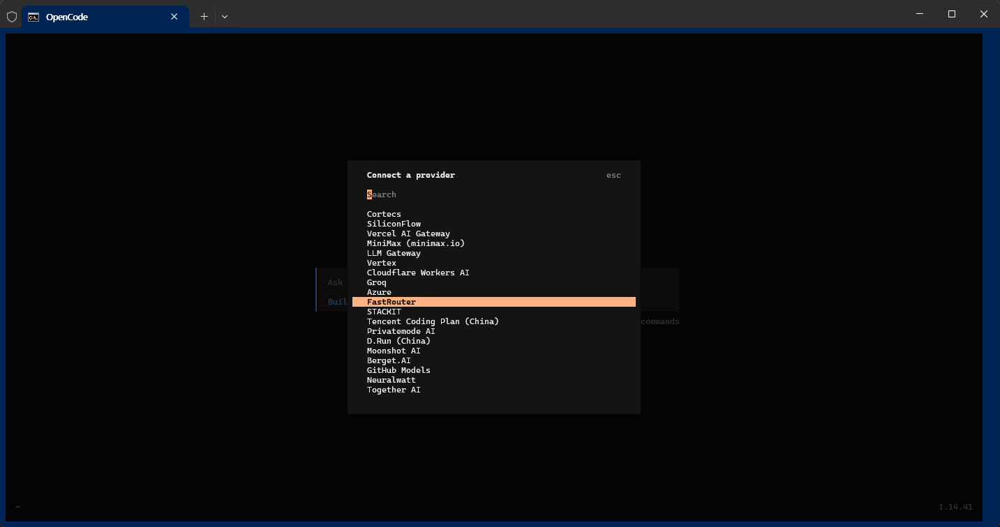
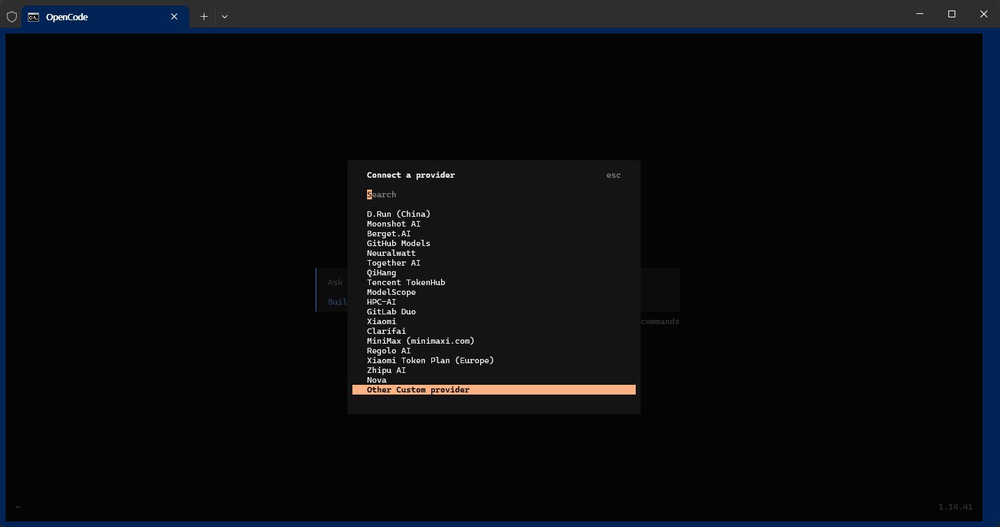

# OpenCode_Prj

* YOUTUBE :
    * https://youtu.be/cdJJ578gP6k

* Links
    * https://github.com/code-yeongyu/oh-my-openagent
    * https://github.com/code-yeongyu/oh-my-codex

## 1. Install

   * https://opencode.ai/

```
npm i -g opencode-ai
```

```
(base) C:\Users\Administrator>npm i -g opencode-ai

added 3 packages in 5s
npm notice
npm notice New minor version of npm available! 11.6.2 -> 11.14.1
npm notice Changelog: https://github.com/npm/cli/releases/tag/v11.14.1
npm notice To update run: npm install -g npm@11.14.1
npm notice
```

## 2. Opencode 실행

```
opencode
```


## 3. Mode : Tab 버튼 : Plan <-> Build

<br>


## 4. 다른모델 선택
   * "/"
   * /connect 에서 모델을 선택하면 됨.

<details>
<summary>접기/펼치기</summary>
<br>
<br>
<br>
<br>
<br>
<br>
<br>
<br>
<br>
</details>

* Popular (인기 항목)
   * OpenCode Zen (Recommended)
   * OpenCode Go
   * OpenAI (ChatGPT Plus/Pro or API key)
   * GitHub Copilot
   * Anthropic (API key)
   * Google
* Providers (제공자 목록)
   * 302.AI
   * Alibaba / Alibaba (China) / Alibaba Coding Plan (China)
   * Scaleway
   * NanoGPT
   * Abacus
   * Perplexity / Perplexity Agent
   * SiliconFlow / SiliconFlow (China)
   * submodel
   * MiniMax (minimaxi.com) / MiniMax Coding Plan (minimax.io / minimaxi.com)
   * DeepSeek
   * Llama
   * OpenRouter
   * Fireworks AI
   * Kimi For Coding
   * Moark
   * IO.NET
   * Jiekou.AI
   * Bailing
   * iFlow
   * v0
   * Hugging Face
   * ZenMux
   * Upstage
   * NovitaAI
   * Xiaomi Token Plan (China / Europe / Singapore)
   * Weights & Biases
   * Chutes
   * DInference
   * Vivgrid
   * Deep Infra
   * Qiniu
   * Kilo Gateway
   * SAP AI Core
   * Morph
   * Cloudflare AI Gateway / Cloudflare Workers AI
   * Mixlayer
   * Z.AI / Z.AI Coding Plan
   * StepFun
   * Nebius Token Factory
   * Poe
   * Helicone
   * Ollama Cloud
   * Amazon Bedrock
   * The Grid AI
   * Baseten
   * FrogBot
   * Zhipu AI / Zhipu AI Coding Plan
   * Venice AI
   * AIHubMix
   * Cerebras
   * LMStudio
   * LucidQuery AI
   * Moonshot AI / Moonshot AI (China)
   * Azure Cognitive Services / Azure
   * abliteration.ai
   * Wafer
   * Cohere
   * CloudFerro Sherlock
   * KUAE Cloud Coding Plan
   * xAI
   * Meganova
   * Vertex (Anthropic) / Vertex
   * evroc
   * Synthetic
   * Nvidia
   * Inference
   * Inception
   * Kiro
   * Requesty
   * DigitalOcean
   * Vultr
   * Mistral
   * OVHcloud AI Endpoints
   * Friendli
   * Cortecs
   * Vercel AI Gateway
   * LLM Gateway
   * Groq
   * FastRouter
   * STACKIT
   * Tencent TokenHub / Tencent Coding Plan (China)
   * Privatemode AI
   * D.Run (China)
   * Berget.AI
   * GitHub Models
   * Neuralwatt
   * Together AI
   * QiHang
   * HPC-AI
   * GitLab Duo
   * Clarifai
   * Regolo AI
   * Nova
   * Other Custom provider


